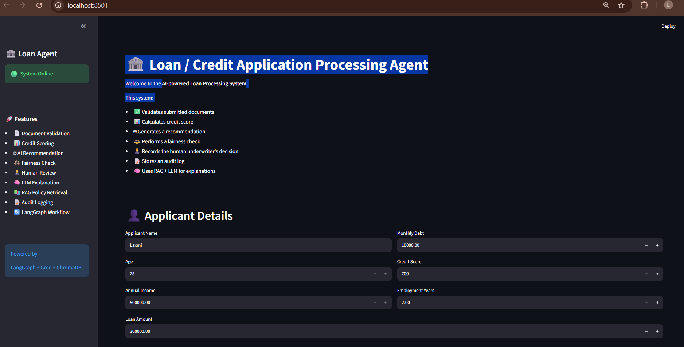
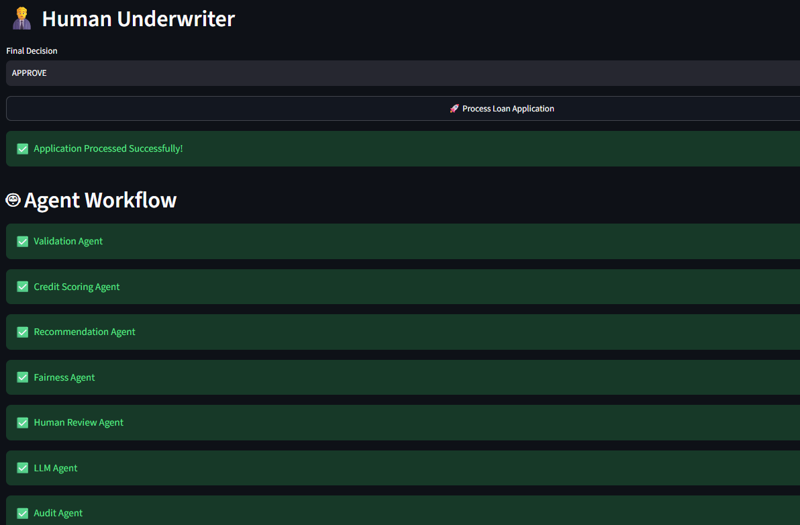
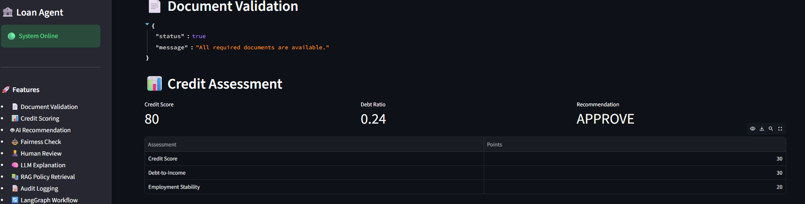
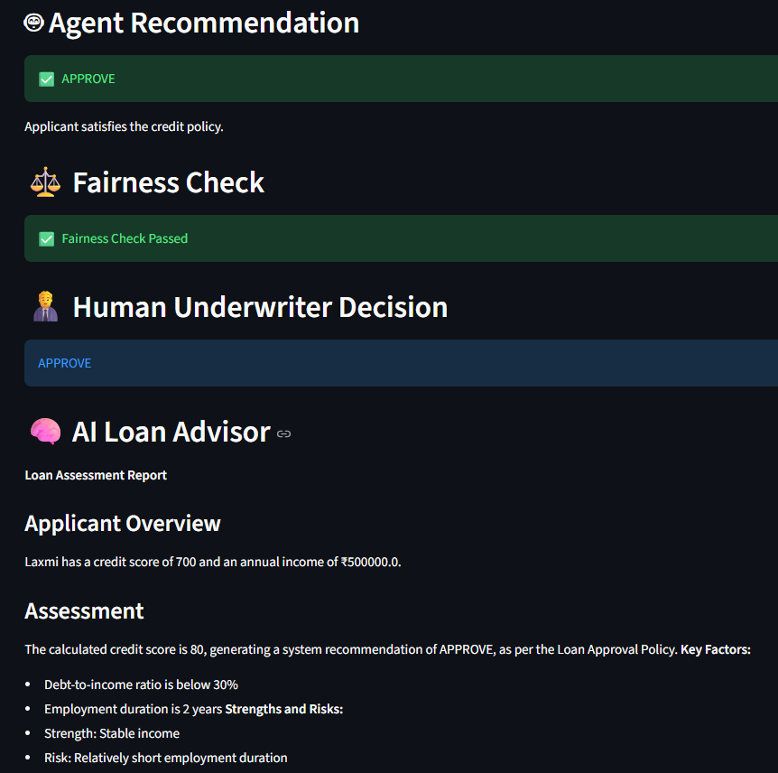
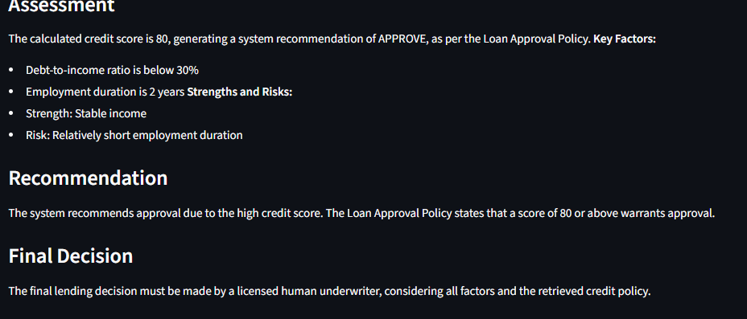

# 🏦 AI-Powered Loan / Credit Application Processing Agent

An intelligent multi-agent loan approval system built using **LangGraph**, **LangChain**, **Groq LLM**, **ChromaDB**, **RAG**, and **Streamlit**.

The system automates loan application processing by validating documents, calculating credit scores, generating AI recommendations, performing fairness checks, incorporating human review, retrieving organizational credit policies using RAG, and maintaining audit logs.

---

## 📌 Features

- ✅ Document Validation Agent
- 📊 Credit Scoring Agent
- 🤖 AI Recommendation Agent
- ⚖️ Fairness Checking Agent
- 👨‍💼 Human Underwriter Review
- 🧠 LLM-powered Loan Explanation (Groq Llama)
- 📚 Retrieval-Augmented Generation (RAG)
- 🗂️ ChromaDB Vector Database
- 🔄 LangGraph Multi-Agent Workflow
- 📝 Audit Logging
- 📥 Downloadable Audit Reports
- 🌐 Interactive Streamlit Dashboard

---

# 🏗️ System Architecture

```

                    Streamlit Dashboard
                            │
                            ▼
                   LangGraph Workflow
                            │
        ┌────────────────────────────────────┐
        │ Document Validation Agent          │
        ├────────────────────────────────────┤
        │ Credit Scoring Agent               │
        ├────────────────────────────────────┤
        │ Recommendation Agent               │
        ├────────────────────────────────────┤
        │ Fairness Agent                     │
        ├────────────────────────────────────┤
        │ Human Review Agent                 │
        ├────────────────────────────────────┤
        │ LLM + RAG Explanation Agent        │
        ├────────────────────────────────────┤
        │ Audit Logging Agent                │
        └────────────────────────────────────┘
                            │
                            ▼
                     Final Loan Decision

| Category              | Technologies                         |
| --------------------- | ------------------------------------ |
| Programming Language  | Python                               |
| Frontend              | Streamlit                            |
| Agent Framework       | LangGraph                            |
| LLM Framework         | LangChain                            |
| Large Language Model  | Groq (Llama 3.3 70B)                 |
| Vector Database       | ChromaDB                             |
| Embeddings            | HuggingFace Sentence Transformers    |
| Retrieval             | RAG (Retrieval-Augmented Generation) |
| Environment Variables | python-dotenv                        |
| Data Handling         | Pandas                               |
| Logging               | CSV Audit Logs                       |

loan-credit-agent/
│
├── app/
│   ├── agents/
│   ├── models.py
│   ├── validator.py
│   ├── scorer.py
│   ├── recommendation.py
│   ├── fairness.py
│   ├── human_gate.py
│   ├── audit.py
│   ├── llm_explainer.py
│   ├── state.py
│   ├── graph.py
│   └── main.py
│
├── rag/
│   ├── ingest.py
│   ├── retriever.py
│   └── data/
│
├── data/
│   ├── chromadb/
│   ├── policies/
│   └── audit_log.csv
│
├── ui/
│   └── streamlit_app.py
│
├── requirements.txt
├── .env
└── README.md

git clone https://github.com/LaxmiprasannaBandam/loan-credit-agent.git

cd loan-credit-agent
Create Virtual Environment
python -m venv .venv
Activate
Windows
.venv\Scripts\activate
pip install -r requirements.txt
Create a .env file
GROQ_API_KEY=your_api_key_here
Ingest Credit Policy into ChromaDB
python rag/ingest.py


Run the Application
streamlit run ui/streamlit_app.py


🧠 Agent Workflow
Document Validation
Credit Score Calculation
Loan Recommendation
Fairness Evaluation
Human Underwriter Review
RAG Policy Retrieval
LLM Explanation Generation
Audit Logging

📚 RAG Workflow

Credit Policy
      │
      ▼
Text Splitter
      │
      ▼
Embeddings
      │
      ▼
ChromaDB
      │
      ▼
Similarity Search
      │
      ▼
Retrieved Context
      │
      ▼
Groq LLM
      │
      ▼
Loan Explanation


📊 Dashboard Features
Applicant Information
Document Upload
Credit Assessment
AI Recommendation
Fairness Check
Human Underwriter Decision
AI Loan Advisor
Audit History
Download Audit Log

🔒 Human-in-the-Loop

The system follows a Human-in-the-Loop approach.

AI provides a recommendation, but the final loan approval decision is always made by a human underwriter.

📈 Future Enhancements
OCR-based document verification
Fraud detection
Loan default prediction
Explainable AI (SHAP/LIME)
Real-time bank database integration
Multi-language support
Docker deployment
Cloud deployment (AWS/Azure/GCP)

📸 Screenshots






👩‍💻 Author
Laxmiprasanna Bandam
B.Tech CSE
BVRIT Hyderabad College of Engineering for Women

⭐ If you found this project useful, consider giving it a star!

